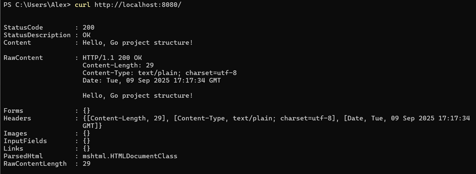
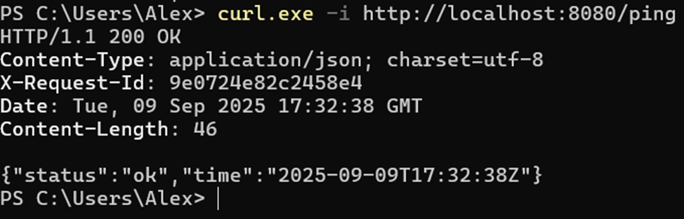
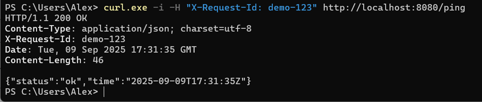
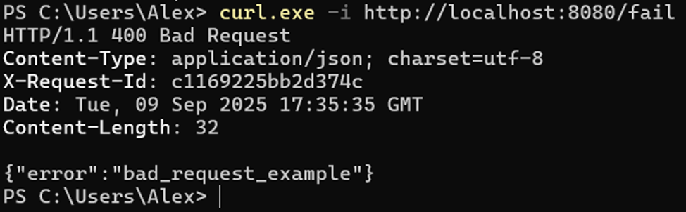
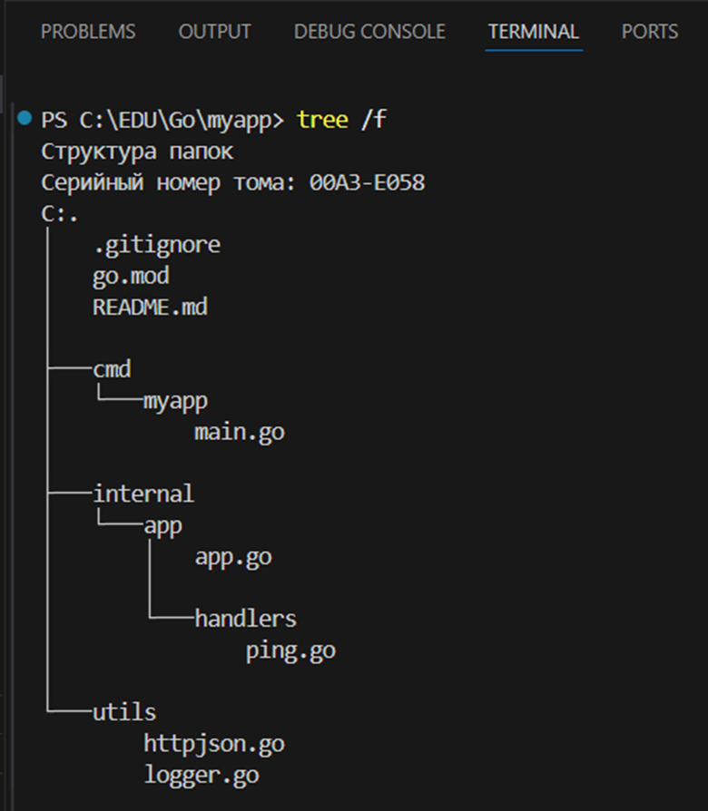

# Практическое занятие №2

## Тема: Структура Go-проекта

**Студент:** Холодков А.Д.  
**Группа:** ЭФМО-01-25

### Установка и запуск
1. Клонирование репозитория (только ветка текущей практики)
```bash
git clone -b pz2 --single-branch https://github.com/Alex-kholod/Go-Practic-1.git
```
2. Переход в директорию проекта
```bash
cd Go-Practic-1
```
3. Запуск приложения
```bash
go run ./cmd/myapp
```

### Принцип работы
После запуска приложения можно использовать его endpoint's для взаимодействия.
#### Поддерживаемые endpoint's:
## 1. GET /
   #### Формат ответа:
   
## 2. GET /ping
   #### Формат ответа:
   a) без передачи заголовка
   
   b) с передачей заголовка "X-Request-Id"
   

## 4. GET /fail
   #### Формат ответа:
   

# Структура проекта:


## Описание структуры:
- cmd/myapp - Основное приложение
- internal/ - Внутренние пакеты c логикой обработки (не для внешнего использования)
- utils/ - Внутренний пакет вспомогательных функций для проекта (логирование, формат вывода json)
- go.mod - Файл модуля Go с зависимостями
